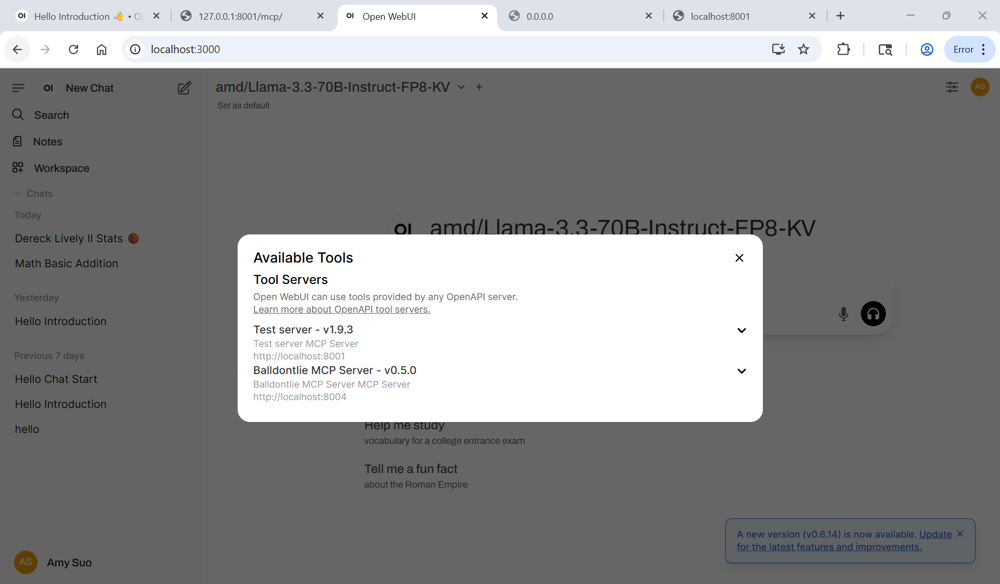
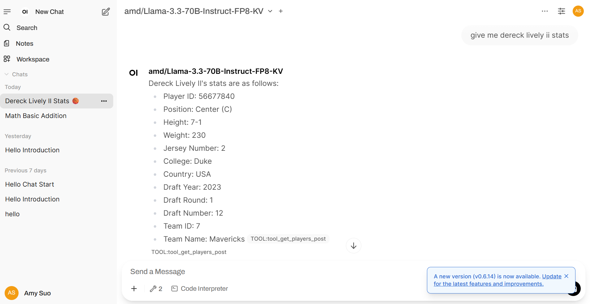
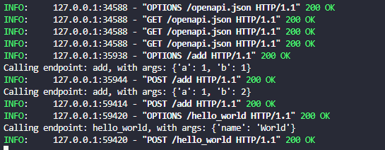

<div align="center">

<h1> ⭐  AMD AI Agent ⭐ </h1>
meow
<div align="left">


<!-- TABLE OF CONTENTS -->

<details>
  <summary>✨ Table of Contents ✨ </summary>
  <ol>
    <li>
      <a href="#about-the-project">About The Project</a>
      <ul>
        <li><a href="#built-with">Built With</a></li>
      </ul>
    </li>
    <li>
      <a href="#getting-started">Getting Started</a>
      <ul>
        <li><a href="#prerequisites">Prerequisites</a></li>
        <li><a href="#installation">Installation</a></li>
      </ul>
    </li>
    <li><a href="#usage">Usage</a>
      <ul>
        <li><a href="#examples">Examples</a></li>
      </ul></li>
    <li><a href="#license">License</a></li>
    <li><a href="#contact">Contact</a></li>
    <li><a href="#acknowledgments">Acknowledgments</a></li>
  </ol>
</details>

<!-- ABOUT THE PROJECT -->

## 🌟 About The Project 🌟

Model Context Protocols (MCPs) have brought a new perspective on AI and Large Language Models (LLMs), emerging as a powerful tool able to connect multiple models and APIs to remote machines. The  open-source framework works similar to REST API and provides an interface that allows models to interact with data and context, universalizing the way that AI agents integrate into systems. This project demonstrates the capabilities of MCPs and how they can be used with AMD ROCm machines. The repository contains a Docker Compose file that uses vLLM to build an AI Agent that has function calling capabilities. It also contains a skeleton MCP server that can be integrated with OpenWebUI.

Poetry MCP Server: Why poetry? Being passionate for both AI and poetry is quite the challenge. AI is indeed elegant and capable, but it has its limitations. Art is human in nature, and thus can never be created by algorithms and machines. AI can only imitate art; it reads data and spits out a replica. So what purpose is a Poetry AI if it cannot create poetry? My friends in academia often say "A better reader makes a better writer". The more literature one reads, the better and more sophisted their writing becomes. In a way, we are similar to the algorithms. We take in data, analyze it for things we like, and replicate those things in our art. But, where we and the technology diverge is with our individuality and creativity. It is the fact of life that each and every person is different, with their own experiences and perceptions. Our personalities, memories, and quirks compose the unique way we read and write. That is what births our creativity, our ability to think of ideas in a way that no one else in the entire world has done. But we cannot possibly read or know everything. At times, we are lost, not knowing where to go next. That is where AI can help. 
The Poetry MCP Server provides tools that use SQL queries into a dataset pulled from the Poetry Foundation, enabling the AI agent to access an inhuman amount of poetry data, categorized by Poet, Title, and Tags. It provides basic functionalities, such as searching for particular author or theme or chaining multiple queries to find, for example, poets who write about similar topics. Using context from conversation history, it refines its searches by prioritizing certain preferences or topics. Think of it as an (almost) all-knowing librarian able to provide a myriad of recommendations and references. 
The Poetry MCP Server additionally hosts poetry-writing functionalities through OpenAI Chat Completions. When given a user-written poem, it is able to provide guided feedback with citations from the dataset. As a data analysis tool, it is able to cross-compare themes, motifs, imagery, and more. While LLMs cannot create art, they do specialize in next word prediction or fill-in-the-blank tasks, such as finding synonyms or rhymes. Its tools also allow for it to refine its generation with common words in pre-existing poetry. In any and all word generation tools, users are given a wide selection of words and, of their own accord, must choose which to use if they wish to do so. 
However, the MCP Server does NOT support any type of generation that attempts to generate full phrases, lines, or poems. As a writer myself, it breaches ethics and reinforces the heavy stigma around AI in the English Literary world. I have created this MCP server in hopes of creating a bridge between my two interests and to use my passion for AI to better young writers and foster their creativity in a current day so engrossed in AI. I wish to show that generative AI can be used ethically and safely by artists. 

### ✨ Built With ✨

* not entirely sure what to put here

<!-- GETTING STARTED -->

## 🌟 Getting Started 🌟

### ✨ Prerequisites ✨

* **Linux**: see the [supported Linux distributions](https://rocm.docs.amd.com/projects/install-on-linux/en/latest/reference/system-requirements.html#supported-operating-systems).
* **ROCm**: see the [installation instructions](https://rocm.docs.amd.com/projects/install-on-linux/en/latest/tutorial/quick-start.html).
* **GPU**: AMD Instinct™ MI300X accelerator or [other ROCm-supported GPUs](https://rocm.docs.amd.com/projects/install-on-linux/en/latest/reference/system-requirements.html).
* **Docker**: with Docker Compose - [install](https://docs.docker.com/engine/install/).

### ✨ Installation ✨

1. Clone the repo
   
   ```sh
   git clone https://github.com/github_username/repo_name.git
   ```
2. Change git remote url to avoid accidental pushes to base project
   
   ```sh
   git remote set-url origin github_username/repo_name
   git remote -v # confirm the changes
   ```
3. Run the docker compose file to build and start up OpenWebUI and the vLLM container
   
   ```sh
   docker compose up -d
   ```

* The current docker compose file is set up with the model Llama-xLAM-2-70b-fc-r, which is optimized for function calling capabilities. To change the model, replace the command parameter of the vllm service with:
  
  ```yaml
  command: ["/bin/sh", 
            "-c", 
            "vllm serve <model_name> 
            --port 8001 --enforce-eager 
            --gpu-memory-utilization 0.95 --tensor-parallel-size 2"]
  ```
* Make sure to set up the vllm container to direct to your local models folder. You can do this by modifying the volumes parameter
  
  ```yaml
  volumes:
    - </path/to/your/models>:/hf_home
  ```
* Ensure that the OpenWebUI container is redirected to the proper local path
  
  ```yaml
  volumes:
    - volumes:
      - </path/to/your/repository>/open-webui:/app/backend/data
  ```
* The AI agent should automatically connect to the OpenWebUI image. If it does not, simply go to the `admin panel`, and in `settings` under `connections` add a new connection with the url `http://vllm:8000/v1` and verify the connection.

4. To stop the Ai Agent, simply do
   
   ```sh
   docker compose down
   ```

## 🌟 Usage 🌟

✨ **If you are hosting your own MCP server**
The skeleton server is stored in the MCP file in `server.py`. To start the server, first install MCPO using pip:

```sh
pip install mcpo
```

Then run:

```sh
mcpo --port 8002 -- python server.py
```

✨ **If you are hosting an MCP server from Smithery.ai**
Install the server using auto install. You may have to install npm first.

```sh
sudo apt install npm
```

Then you can run the server with the given command from smithery inputted to mcpo.

```sh
mcpo --port 8004 -- <server start up command>
```

The MCP server should automatically connect to the running OpenWebUI image. If it does not, simply go to `settings` and add a new tool server with the url ``

### ✨ Examples ✨

This is the Open WebUI with two available MCP servers: the skeleton server `server.py` and the [Balldontlie server at smithery](https://smithery.ai/server/@mikechao/balldontlie-mcp "https://smithery.ai/server/@mikechao/balldontlie-mcp"),

* 

This is the response from the AI agent when using an MCP tool from the `Balldontlie` MCP server.

* 

Command line logs with requests to the skeleton test server.

* 


## 🌟 License 🌟

i also do not know what to put here

<!-- CONTACT -->

## 🌟 Contact 🌟

Amy Suo - amysuwoah@gmail.com / amy.suo@amd.com / as331@rice.edu


Project Link: [https://github.com/luminarchy/AMD-2025-AI-Agent-Demo](https://github.com/luminarchy/AMD-2025-AI-Agent-Demo)

<!-- ACKNOWLEDGMENTS -->

## 🌟 Acknowledgments 🌟

* [AMD ROCm Blogs](https://rocm.blogs.amd.com/)
* [Smithery](https://smithery.ai/)
* [BallDontLie API](https://www.balldontlie.io/)
* [BallDontLie MCP Server](https://github.com/mikechao/balldontlie-mcp)
* Furthermore i do not know what to put here

