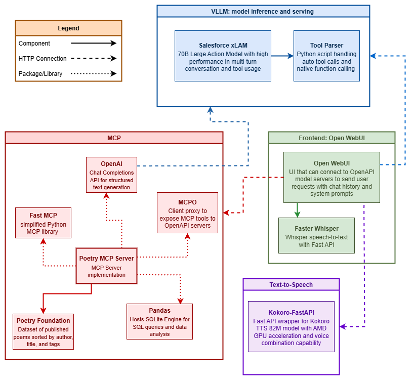
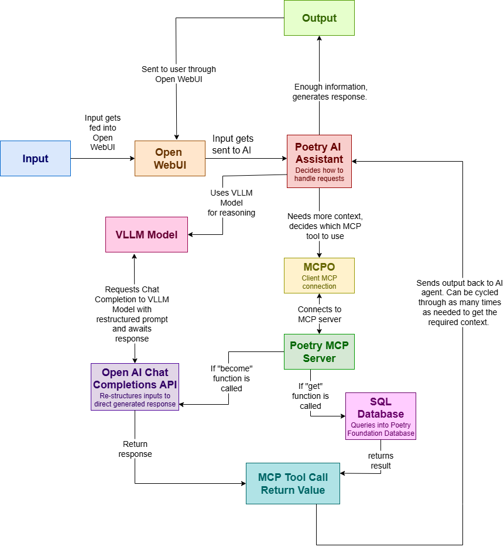
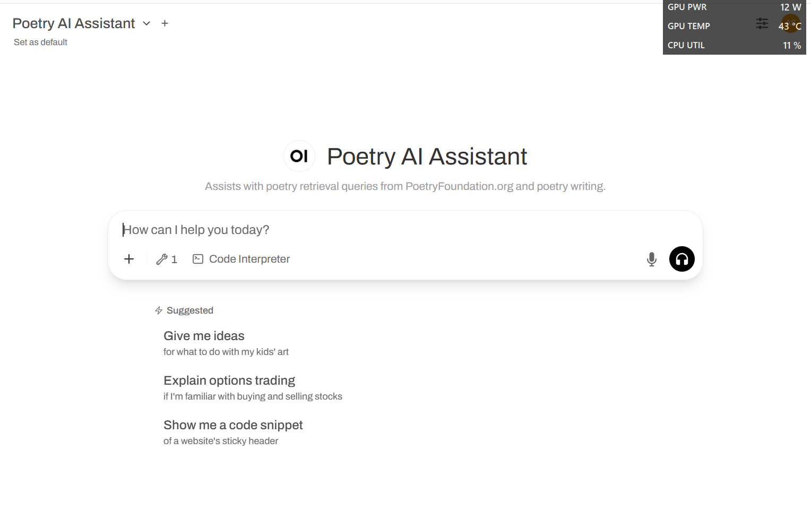
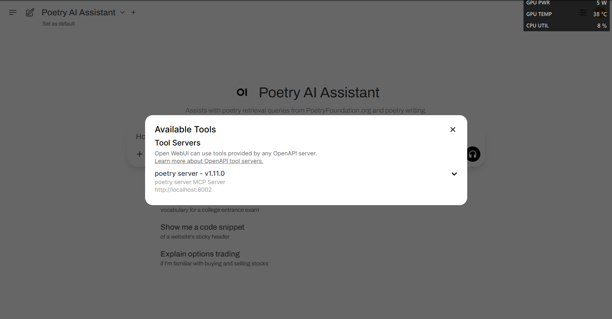
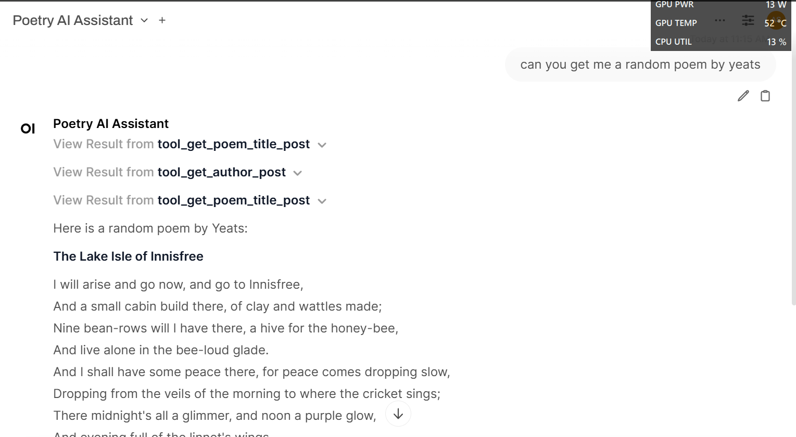
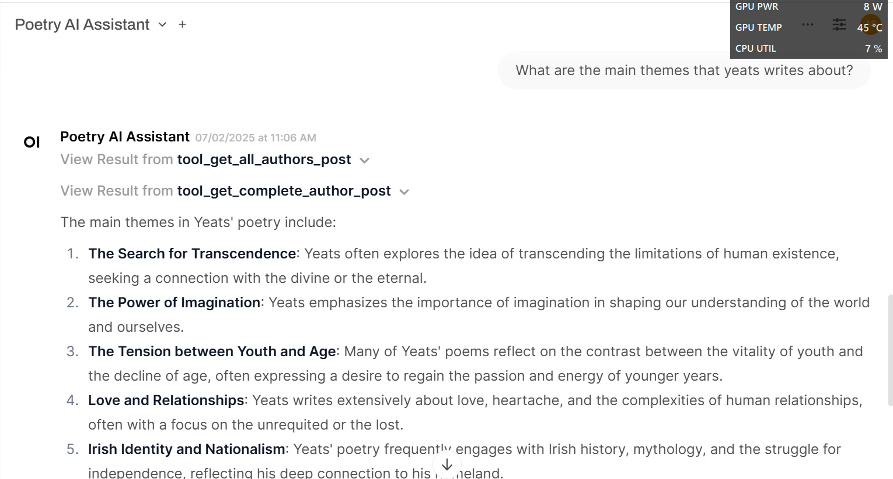
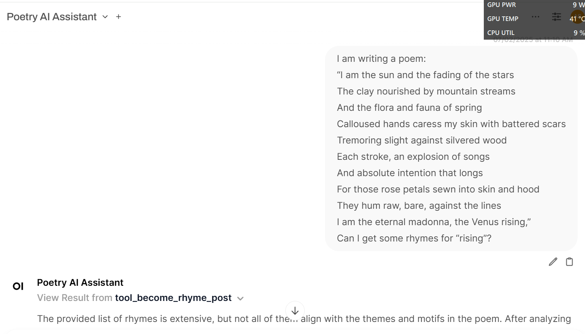
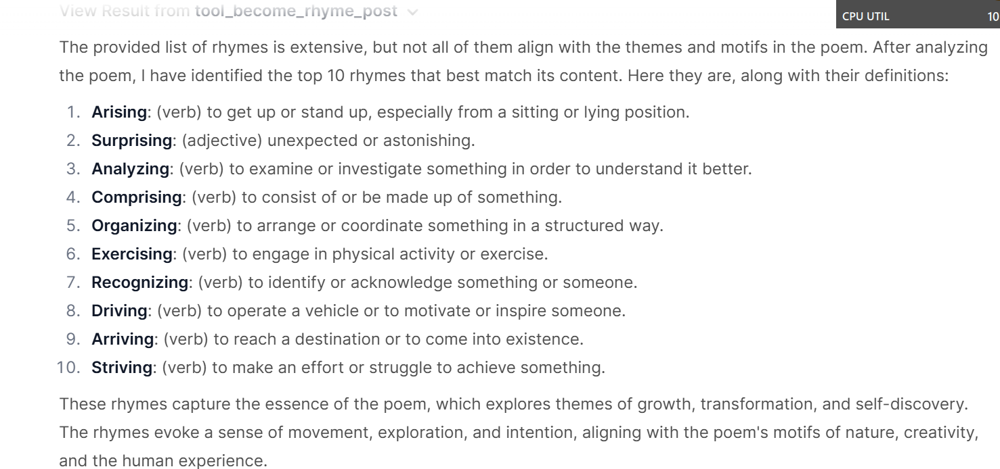
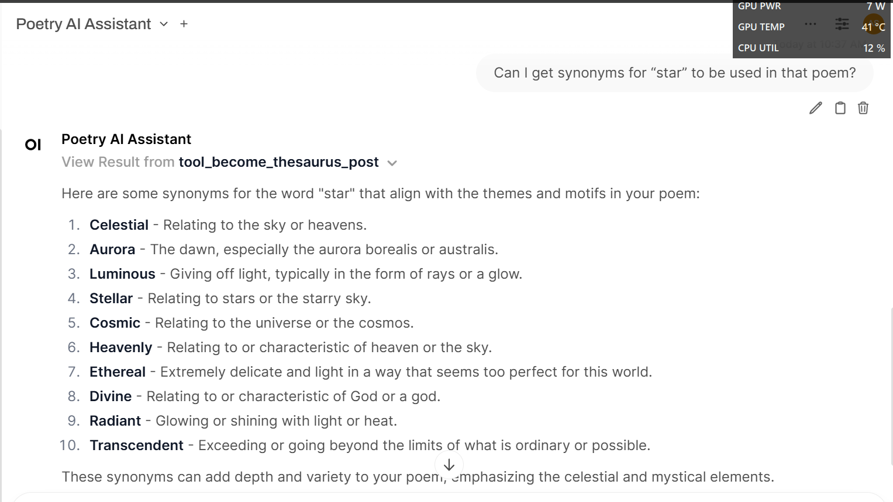

<div align="center">

<h1> ⭐  AMD AI Agent ⭐ </h1>
meow
<div align="left">

<!-- TABLE OF CONTENTS -->

<details>
  <summary>✨ Table of Contents ✨ </summary>
  <ol>
    <li>
      <a href="#about-the-project">About The Project</a>
      <ul>
        <li><a href="#how-it-works">How it Works</a></li>
      </ul>
    </li>
    <li>
      <a href="#getting-started">Getting Started</a>
      <ul>
        <li><a href="#prerequisites">Prerequisites</a></li>
        <li><a href="#installation">Installation</a></li>
      </ul>
    </li>
    <li><a href="#usage">Usage</a>
      <ul>
        <li><a href="#examples">Examples</a></li>
      </ul></li>
    <li><a href="#troubleshootinge">Troubleshooting</a></li>
    <li><a href="#frequently-asked-questions">FAQ</a></li>
    <li><a href="#contact">Contact</a></li>
    <li><a href="#license">License</a></li>
    <li><a href="#acknowledgments">Acknowledgments</a></li>
  </ol>
</details>

<!-- ABOUT THE PROJECT -->

## 🌟 About The Project 🌟

Model Context Protocols (MCPs) have brought a new perspective on AI and Large Language Models (LLMs), emerging as a powerful tool able to connect multiple models and APIs to remote machines. The  open-source framework works similar to REST API and provides an interface that allows models to interact with data and context, universalizing the way that AI agents integrate into systems. This project demonstrates the capabilities of MCPs and how they can be used with AMD ROCm machines. The repository contains a Docker Compose file that uses vLLM to build an AI Agent that has function calling capabilities. It also contains a poetry MCP server to demonstrate the utility of the agent.

See [Poetry MCP](mcp/README.md) for more information about the Poetry MCP server. 

See [Base MCP](base-mcp/README.md) for more information about the Base MCP server. 

### ✨ How it Works ✨

* 

The AI agent uses Open WebUI for its user interface, which allow for a seamless integration with Whisper and Kokoro for STT and TTS capabilities. For the OpenAI model connecton, it uses the rocm instance of vllm to serve the Salesforce xLAM 2 model. The xLAM series is known for its effectiveness with native tool calling and xLAM hosts its own tool parser which is used for auto tool choice. Open WebUI uses MCPO for its MCP client connection, which hosts the MCP as a tool server; however, this limits the MCP to just its tool capabilities.

MCPO exposes the tools on the MCP server to the AI agent on Open WebUI allowing the agent to choose whichever tools it may need for a request. The Poetry MCP tools can separated into two categories. One, labeled using "get", fetches data from a Poetry Foundation dataset loaded into the server using SQLite queries. The other, labeled using "become", uses OpenAPI chat completions for guided word generation or feedback generation. The chat completions use the same model as the one backing the Open WebUI AI agent; however, it works separately from the agent. There are two vllm endpoints that run simultaneously. Both use the same model for reasoning; however, they are fed different context and system prompts, and therefore, are assigned different tasks to complete. This is necessary, because the xLAM model on its own is prone to hallucination when tasked with generation of constructive criticism or rhymes, and must be guided with the necessary system prompts to provide the most accurate information as possible.

The response from each tool that the AI agent calls is then fed back into the agent where it decides if the information that it has is enough to answer the user input. If it is not, it cycles through the tool calling cycle until it decides that the information is enough. Once the AI Agent reaches that point, it builds a response using the information that it retrieved from the tool calls and returns that back out to the user.

* 

<!-- GETTING STARTED -->

## 🌟 Getting Started 🌟

### ✨ Prerequisites ✨

* **Linux**: see the [supported Linux distributions](https://rocm.docs.amd.com/projects/install-on-linux/en/latest/reference/system-requirements.html#supported-operating-systems).
* **ROCm**: see the [installation instructions](https://rocm.docs.amd.com/projects/ install-on-linux/en/latest/tutorial/quick-start.html).
* **GPU**: AMD Instinct™ MI300X accelerator or [other ROCm-supported GPUs](https://rocm.docs.amd.com/projects/install-on-linux/en/latest/reference/system-requirements.html).
* **Docker**: with Docker Compose - [install](https://docs.docker.com/engine/install/).

### ✨ Installation ✨

1. Clone the repo
   
   ```sh
   git clone https://github.com/github_username/repo_name.git
   ```
2. Change git remote url to avoid accidental pushes to base project
   
   ```sh
   git remote set-url origin github_username/repo_name
   git remote -v # confirm the changes
   ```
3. Run the docker compose file to build and start up the containers
   
   ```sh
   docker compose up -d
   ```

* The current docker compose file is set up with the model Llama-xLAM-2-70b-fc-r, which is optimized for function calling capabilities. To change the model, replace the command parameter of the vllm service with:
  
  ```yaml
  command: ["/bin/sh", 
            "-c", 
            "vllm serve <model_name> 
            --port 8001 --enforce-eager 
            --gpu-memory-utilization 0.95 --tensor-parallel-size 2"]
  ```
* Make sure to set up the vllm container to direct to your local models folder. You can do this by modifying the volumes parameter
  
  ```yaml
  volumes:
    - </path/to/your/models>:/hf_home
  ```
* **If you are using ROCm** Kokoro-FastAPI does not support ROCm. This project uses the implementation in this [repo](https://github.com/bgs4free/Kokoro-FastAPI/tree/add-rocm-support). If you are having issues connecting to Kokoro, check this [post](https://github.com/remsky/Kokoro-FastAPI/issues/66). Note that the project does not need Kokoro to run. You may remove the Kokoro container from the Docker Compose.
  
* Ensure that the OpenWebUI container is redirected to the proper local path
  
  ```yaml
  volumes:
    - volumes:
      - </path/to/your/repository>/open-webui:/app/backend/data
  ```
* The AI agent should automatically connect to the OpenWebUI image. If it does not, simply go to the `admin panel`, and in `settings` under `connections` add a new connection with the url (ex: `http://vllm:8000/v1`) and verify the connection.

4. To stop the Ai Agent, simply do
   
   ```sh
   docker compose down
   ```

## 🌟 Usage 🌟

✨ **If you are using the Poetry MCP Server**
The Poetry mcp server code is set up in the `/mcp` directory which contains the scripts to run the MCP server as well as a separate README for the server contianing information about the recommended setup for Open WebUI.

To set up the model, go to Open WebUI's workspace tab located on the left panel and in `Models`, create a new model titled "Poetry AI Assistant". In the custom model's settings, set the system prompt to the value stored under `System Prompt` in `mcp/setup.txt`. Choose the Base Model and save changes.
Next, go to the `admin panel`, and find the model that is connected to your OpenAI base url. Change that model's system prompt to the value stored under `Model Prompt` in setup.txt. Save the changes.
This will allow you to use a singular model as two separate AI agents, ensuring that all tool functions are called correctly.

✨ **If you are hosting the base MCP server**

* The [base MCP server](/base-mcp) uses the same underlying architecture of the Poetry MCP server to query and insert into any labeled dataset.
* First upload your database into the base-mcp folder as `database.xlsx` file or replace the [existing file](base-mcp/database.xlsx) with your dataset and modify the code if need be.
* A separate [Dockerfile](/Dockerfile.base) is provided for the base MCP as `Dockerfile.base` in the parent directory. Ensure that the all of the necessary files in base-mcp are copied in the Dockerfile.
* Modify the [Docker Compose](/compose.yaml) so that the `dockerfile` parameter is set to `Dockerfile.base`
* Modify the `NUM_COLS` environment variable in the docker compose to be the number of data columns in your dataset
* You can startup the server normally, but ensure that Open WebUI is configured for your application. 

The MCP server should automatically connect to the running OpenWebUI image. If it does not, simply go to `settings` and add a new tool server with the server url.

### ✨ Examples ✨

This is the Open WebUI with the Poetry AI agent

* 

This is what the MCP server shows up as on Open WebUI.

* 

Prompting the MCP server for a random poem by W.B. Yeats. Shows tool-chaining and native function calling. The AI agent first searches for a poem by Yeats under the name "random". Then retrieves a list of all poems written by Yeats and randomly selects a poem title. It then searches for that poem in the database and returns the full poem.

* 

Asking the MCP server for Yeats main themes. Shows post-processing of tool calls, as the MCP tool returns all poems and corresponding tags by Yeats and agent has to process that information to find top most common tags.

* 

Asking the AI agent for a rhyme.

* 

Rhyme response:

* 

Asking the AI agent for synonyms and response using the same poem from the previous chat.

* 

## 🌟 Troubleshooting 🌟

* To view logs:
  Run:
  ```sh
  docker compose logs -f <container-name>
  ```

* If Kokoro does not connect using the `localhost` url:
  Find the docker container network url. In VSCode, locate the docker tab on the left menu bar and locate the parent docker container under the `networks` section and open the corresponding file. Find the network url for the Kokoro container in the file.
  
  In Open WebUI, open the admin panel, and click the `Audio` tab. Under TTS, change the engine to `OpenAI`. Fill in the OpenAI base url with the docker container network url and fill in the OpenAI key with `not-needed`. Change the model name to `Kokoro`. To see all voices available, go to `http://localhost:8880/docs`.
* If STT does not work:
  Try adding audio types to the "Supported MIME Types" field in the `Audio` admin panel setting.
  
* If Open WebUI does not load (if the webpage isn't connecting or if the page is stuck on the Open WebUI loading screen):
  * Ensure that you are forwarding the Open WebUI port (default 3000). In VSCode, this can be done by switching to the `ports` tab in the lower window and adding the port to the forwarded ports. 
  * You may need to update Open WebUI to the latest version. Stop and remove all containers and run
    ```sh
    docker pull ghcr.io/open-webui/open-webui:main
    ```
    to pull the latest docker image
  * If this does not work, try clearing browser history or connecting to the page through incognito/privacy mode.
  * Try stopping the contianer and rebooting the local computer and check your local internal connection.
  * Open WebUI may be stuck attempting to connect to something else. Check all of your docker containers to make sure they are functioning properly. Open WebUI can also be run in dev mode to view its Swagger API

* If the VLLM server is not connecting to Open WebUI
  * Check the connection by pinging the VLLM 
    ```sh
    curl http://localhost:8000/v1/models
    ```
  * Check the vllm's Swagger API at [http://localhost:8000/docs](http://localhost:8000/docs)
  * Ensure the VLLM url in Open WebUI is [http://vllm:8000/docs](http://vllm:8000/docs)
  * Check port forwarding and local connections
  * Make sure that you do not have any other instances of Open WebUI running on either the local or remote machine with the same port.
    
* If the VLLM server is not connecting to the Poetry MCP Server
  * Check the steps above
  * Try interchanging http://localhost:8000/v1 and http://vllm:8000/v1 for the OpenAI url
    
* If the MCP server is not connecting to the Open WebUI
  * Check all of the steps above
  * Check the Swagger API for the MCP server
  * Open the Open WebUI server in incognito/privacy mode

* If the application stops working in the middle of a conversation
  * The conversation context may be too long. Try opening a new conversation.

<!-- FAQ -->
## 🌟 Frequently Asked Questions 🌟
> Why MCP?
  * Gen AI is powerful, but its knowledge base is shallow and only contians the information that it has been trained on or the information that the user provides it. This can cause the model to hallucinate, pulling from a variety of potentially misleading information sources and generating an answer that is either wildly inaccurate or gibberish, such as with the example of rhymes. The AI model does not know that it is wrong, because it does not have the information to tell it that it is wrong. MCP connects AI models to such an information source, giving it the *context* that it needs to provide accurate, helpful answers for specific and complex applications. These information sources can be databases or APIs. An AI agent can uses this context to conduct context specific tasks such as generating poetry feedback by referencing information about rhyme and meter and works by published poets to provide the most accurate, informated response. MCP also allows for the AI Model to connect to multiple information sources and tools, providing the information that allows the AI agent to choose which to use in a given situation.
  
> What are the applications of this project?
  * The Poetry MCP server is just a fun that I had in order to demonstrate the capabilites of MCP and agentic AI on AMD ROCm GPUs that I thought could aid young writers in their creative journey. But this framework can be easily adapted to any data-based application such as to aid information systems or manufacturing. The underlying code connects to an Excel file and uses SQLite for quick and easy queries, so there is no need to build an API. I have provided a starter MCP server for a general database in the folder [Base-MCP](/base-mcp). This server contains tools to query and insert into a database. The Poetry MCP server also includes examples of structured model sampling in the file [poemtools.py](mcp/poemtools.py), which can be used to turn general prompts into specific guided requests to the AI Model.

> Can this application be run locally? What if I have super cool gpus?
  * Short answer, no. This application wasn't meant to run on a local computer, since it needs a large model context length. This particular applicatio was built using a total of 3 GPUs on a MI300X machine with the Salesforce XLAM model using two GPUs at 95% capacity. It would be both easier and better to have one instance of the application running with a large 70B model with multiple remote connections. The MCP sever also is able to handle concurrent requests for this application. However, this model can be run a smaller 1B model for testing and experimentation

> How can I use a different MCP server?
  * Replace the MCP service in the Docker Container with the necessary parameters for the MCP server. If you are hosting your own server, make sure to change the Dockerfile to copy your server files to the container files by using `COPY <filename>` and ensure that all dependencies are listed in the `requirements.txt` file. In the Docker Compose, change the command parameter to be
    ```yaml
     command: ["mcpo", "--port", "8002", "--", "<cmd>", "<for your server>"]
    ```
    such as:
    ```yaml
     command: ["mcpo", "--port", "8002", "--", "python", "server-name.py"]
    ```
    
<!-- CONTACT -->

## 🌟 Contact 🌟

Amy Suo - amysuwoah@gmail.com / amy.suo@amd.com / as331@rice.edu

Project Link: [https://github.com/luminarchy/AMD-2025-AI-Agent-Demo](https://github.com/luminarchy/AMD-2025-AI-Agent-Demo)

<!-- License -->
## 🌟 License 🌟

The [Salesforce xLAM model](https://huggingface.co/Salesforce/Llama-xLAM-2-70b-fc-r) used in this project is created by Salesforce. 

See: 
[xLAM](https://arxiv.org/abs/2504.03601)

<!-- ACKNOWLEDGMENTS -->

## 🌟 Acknowledgments 🌟

* [AMD ROCm Blogs](https://rocm.blogs.amd.com/)
* [the poetry foundation dataset](https://www.kaggle.com/datasets/tgdivy/poetry-foundation-poems)
* [Salesforce xLAM model](https://huggingface.co/Salesforce/Llama-xLAM-2-70b-fc-r)
* [Kokoro-FastAPI](https://github.com/bgs4free/Kokoro-FastAPI/tree/add-rocm-support)
* [VLLM](https://docs.vllm.ai/en/v0.6.5/index.html)
* [FastMCP](https://gofastmcp.com/getting-started/welcome)
* [MCPO](https://github.com/open-webui/mcpo)

